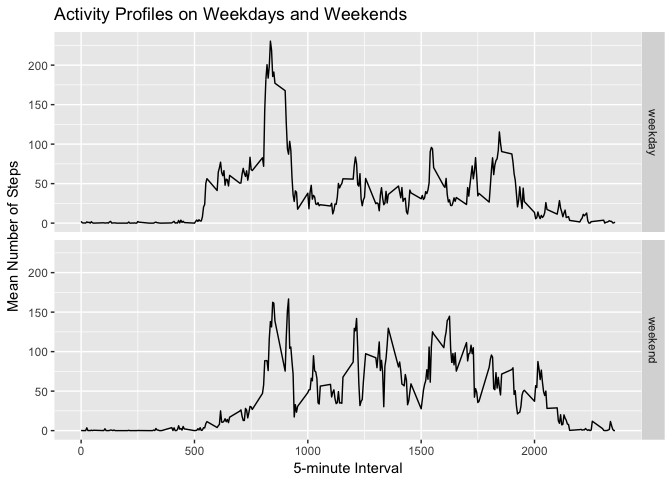

## Loading and preprocessing the data

The following plots and calculations are based on [Activity Monitoring Data][1]
of an anonymous individual collected in October / November 2012.

[1]: https://d396qusza40orc.cloudfront.net/repdata/data/activity.zip


```r
# load the data into a data frame
activity <-
    read.csv(
        file = unzip("./activity.zip"),
        colClasses = c("integer", "Date", "integer")
    )
```


## What is mean total number of steps taken per day?

The total number of daily steps varies as shown in the histogram below.


```r
# calculate the total number of steps taken per day
daily_steps <- with(activity, tapply(steps, date, sum))

# calculate mean daily steps
mean_daily_steps <- format(mean(daily_steps, na.rm = TRUE), scientific = FALSE)

# find median of daily steps
median_daily_steps <- median(daily_steps, na.rm = TRUE)

# plot histogram of daily steps
hist(daily_steps,
     xlab = "Steps per Day",
     main = "Total Number of Steps per Day")
```

<!-- -->

The mean total number of steps taken per day is **10766.19**.  
The median is **10765**.

## What is the average daily activity pattern?


```r
# calculate mean steps for each 5min interval
mean_steps_per_interval <- with(activity, tapply(steps, interval, mean, na.rm = TRUE))

# find maximum steps done in a 5min interval
max_steps_per_interval <- max(mean_steps_per_interval)

# identify the 5min interval with maximum steps
max_steps_interval <- names(which.max(mean_steps_per_interval))

# plot average steps per 5min interval
plot(
    names(mean_steps_per_interval),
    mean_steps_per_interval,
    type = "l",
    xlab = "5-minute Interval",
    ylab = "Mean Number of Steps"
)
abline(v = max_steps_interval, col = "red")
```

<!-- -->

*Average daily activity* peaks in the morning hours with a maximum
at interval **835**.

## Imputing missing values


```r
# logical vector of missing steps
missing_steps <- is.na(activity$steps)

# number of rows with NA steps
count_missing_steps <- sum(missing_steps)
```

The [Activity Monitoring Data][1] has **2304** rows
with missing values (NA).

My strategy for filling in these missing values will be to impute NAs
with the mean for the affected 5-minute interval.


```r
# create a copy of the original data frame
imputed_activity <- data.frame(activity)

# replace NAs with mean steps for affected interval
imputed_activity[missing_steps, ]$steps <-
    mean_steps_per_interval[as.character(imputed_activity[missing_steps, ]$interval)]

# sum up total daily steps
imp_daily_steps <- with(imputed_activity, tapply(steps, date, sum))

# calculate mean daily steps
mean_imp_daily_steps <-
    format(mean(imp_daily_steps, na.rm = TRUE), scientific = FALSE)

# find median of daily steps
median_imp_daily_steps <-
    format(median(imp_daily_steps, na.rm = TRUE), scientific = FALSE)

# plot histogram of daily steps
hist(imp_daily_steps,
     xlab = "Steps per Day",
     main = "Total Number of Steps per Day (with NAs imputed)")
```

<!-- -->

After imputing NA values *mean total number of daily steps* is **10766.19** and *median* is **10766.19**.

Conclusion: Imputing NAs has only little impact on the estimates of the total daily number of steps.

## Are there differences in activity patterns between weekdays and weekends?


```r
# distinguish weekends from workdays
day_type <-
    ifelse(weekdays(imputed_activity$date) %in% c("Saturday", "Sunday"),
           "weekend",
           "weekday")
# and add the new column to our data frame
imputed_activity$day_type <- as.factor(day_type)

# calculate mean steps per interval and day type
mean_steps_by_day_type <-
    aggregate(
        formula = steps ~ interval + day_type,
        data = imputed_activity,
        FUN = mean
    )

# plot mean steps by interval for both day types
qplot(
    interval,
    steps,
    data = mean_steps_by_day_type,
    geom = "line",
    facets = day_type ~ .,
    xlab = "5-minute Interval",
    ylab = "Mean Number of Steps",
    main = "Activity Profiles on Weekdays and Weekends"
)
```

<!-- -->
